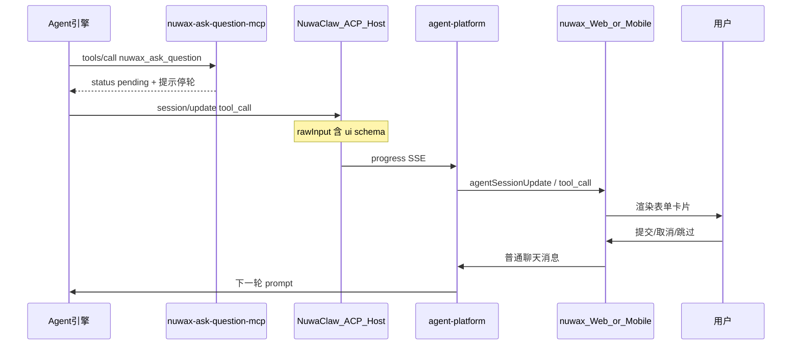

# MCP 交互问答竞品调研报告（含 Nuwax 生态场景）

| 项 | 内容 |
| --- | --- |
| 日期 | 2026-05-29 |
| 范围 | nuwax-ask-question-mcp、nuwaclaw、nuwax、nuwax-mobile、agent-platform |
| 结论摘要 | 市面无可直接替换的跨端富表单 MCP 方案；建议坚持自研契约 + 借鉴 MCP Elicitation / 框架 HITL 机制 |

---

## 1. 场景架构（四仓库 + 双链路）

### 1.1 端到端数据流（MCP Ask）



### 1.2 仓库职责

| 仓库 | 职责 | MCP Ask 关键点 |
| --- | --- | --- |
| **nuwax-ask-question-mcp** | stdio MCP；Zod 校验；注册 `nuwax_ask_question` / `nuwaclaw_ask_user` | 仅返回 `pending`，无 HTTP、无 pending 队列 |
| **nuwaclaw** | ACP Host；MCP proxy；RCoder bridge；permission 服务 | 透传 `tool_call.rawInput`；Ask **不走** `acpRequestPermission` |
| **agent-platform** | 会话 SSE、permission 回执转发 | 透传 `tool_call` 事件；Ask **不走** `/api/agent-interventions/{id}/respond` |
| **nuwax** | Web 聊天 | ACP Permission 已实现；**MCP Ask 专用 UI 未落地** |
| **nuwax-mobile** | 移动聊天 | `mcp-ask-card` + `interventionAdapter` + `buildMcpAskResumeMessage` 基本对齐 v1；仍需补齐 `data.rawInput` 标准路径回归 |

### 1.3 双链路对比（调研时易混淆）

| 维度 | ACP 权限审批 | MCP Ask / Question |
| --- | --- | --- |
| 触发 | 引擎 `session/request_permission` | Agent 调用 MCP 工具 |
| SSE | `acpRequestPermission` / `request_permission` | `agentSessionUpdate` / `tool_call` |
| 识别 | permission request 结构 | `rawInput.schemaVersion === nuwaclaw.mcp_ask.v1` |
| 用户响应 | `POST .../agent-interventions/{id}/respond` → notify-resolved | **普通用户聊天消息** |
| 恢复 | 同 permission 回调恢复 tool | **下一轮** Agent 读消息继续 |
| Web 组件 | `AcpPermissionCard` | 规范要求 `McpAskQuestionCard`（待实现） |
| Mobile 组件 | `acp-permission-card` | `mcp-ask-card`（已实现） |

权威契约：[nuwaclaw/docs/mcp-ask-question-acp-toolcall-v1.md](https://github.com/nuwax-ai/nuwaclaw/blob/main/docs/mcp-ask-question-acp-toolcall-v1.md)。

---

## 2. 我方方案定位（竞品对照基准）

### 2.1 核心设计选择

1. **UI 在自有客户端**：`nuwaclaw.interaction.v1` + JSON Schema / uiSchema，支持 `modal` / `inline` / `wizard` / `table`、文件上传、`enumNames` 等。
2. **恢复模型**：工具返回 `pending` → Agent 停轮 → 用户答案以**可读中文普通消息**进入下一轮（非 MCP 同步等待、非 LangGraph 同 thread resume）。
3. **识别**：仅认标准 `tool_call` + `rawInput`，禁止自定义 `mcpAskQuestion` progress 类型。
4. **轻量 MCP 进程**：契约与校验在 npm 包；状态在会话消息流，不在 MCP server。

### 2.2 与 MCP 包实现一致

```83:101:nuwax-ask-question-mcp/src/index.ts
export async function handleAsk(input: McpAskUserToolInput): Promise<CallToolResult> {
  const parsed = McpAskUserToolInputSchema.parse(input);
  const result = {
    status: "pending" as const,
    requestId: parsed.requestId,
    revision: parsed.revision,
    message:
      "The question has been presented to the user. Stop this turn now. When the user submits the form, their answer will arrive as a new user message.",
  };
  // ...
}
```

---

## 3. 竞品分层与结论（替代 / 借鉴 / 不适用）

### 3.1 协议与标准层

| 方案 | 机制 | 判定 | 说明 |
| --- | --- | --- | --- |
| **MCP Elicitation** | Server 发 `elicitation/create`；Client 以 form 或 url mode 处理；返回 accept/decline/cancel | **借鉴** | 最接近「工具执行中要用户输入」的官方标准；form schema 仍是扁平 primitive 子集；URL mode 可借鉴给敏感/OAuth/支付 fallback；与 pending+下条消息模型不同 |
| **MCP Apps / MCP-UI** | `ui://` 资源、iframe 富 UI | **不适用（短期）** | 适合插件/dashboard；与现有会话内卡片 + 移动 H5 路线不一致 |
| **A2A + HITL** | Task `input-required`、DataPart、远程审批 Agent | **不适用** | 任务/Agent 卡片模型，非 ACP `tool_call` SSE |

**MCP Elicitation 关键限制**（官方 spec 最新 2025-11-25）：

- form mode 的 `requestedSchema` 仍限制为扁平 object + primitive properties；支持 string / number / boolean / enum，以及多选 enum 这类受限数组。
- 不支持复杂嵌套、数组对象、wizard/table/file 等高级 UI（我方 `nuwaclaw.interaction.v1` 超出其子集）。
- URL mode 用于敏感信息、OAuth、支付等不应穿过 MCP client / LLM 上下文的流程；它更像安全 fallback，而不是会话内富表单替代。
- Elicitation 是 MCP 层的请求/响应恢复模型；我方 v1 刻意让 MCP 立即返回 `pending`，再由下一条普通聊天消息恢复。

**兼容策略**（nuwaclaw 归档设计已预见）：简单单页表单可映射为 Elicitation form `requestedSchema`；敏感/OAuth/支付类走 URL mode 或自有安全页面；复杂交互仍走 `nuwaclaw.interaction.v1`。

### 3.2 MCP 开源实现层（npm / GitHub）

| 方案 | Stars/生态 | 交互方式 | 判定 | 与 Nuwax 场景差距 |
| --- | --- | --- | --- | --- |
| **interactive-mcp** | ~345 GitHub stars | 本机 CLI 弹窗、`request_user_input`、可选持久 chat | **不适用** | 需 OS 级 prompt；无法渲染 Web/Mobile 富表单；默认 30s 超时 |
| **interactive-mcp-enhanced** | npm 衍生 | 同上 + 通知音、审批流增强 | **不适用** | 同上 |
| **auq-mcp-server** | npm，功能全 | 独立 TUI 窗口、多选/队列/多语言 | **不适用** | 面向本地 Ralph Loop；非云端 SSE 会话 |
| **mcp-interactive** | npm | Electron 弹窗 `ask_user` | **不适用** | 绑定桌面 MCP Client |
| **mcp-elicitation-demo** | 参考 server | form/url mode 全 primitive 覆盖 | **借鉴** | 用于验证 Client 是否支持 Elicitation capability，非产品替代 |

**结论**：没有任何现成 MCP Server 能同时满足：**跨端 Web/Mobile UI** + **rawInput.ui 富 schema** + **chat 消息恢复** + **与 ACP permission 解耦**。

### 3.3 Agent 框架 / 前端 HITL 层

| 方案 | 暂停机制 | 恢复机制 | 判定 | 可借鉴点 |
| --- | --- | --- | --- | --- |
| **OpenAI Agents SDK** | `needsApproval` → `interruptions` | `RunState.approve/reject` + 同 run `Runner.run(state)` | **借鉴** | 审批项结构化、state 可序列化 → 可映射为 `requestId/revision` 审计 |
| **LangGraph** | `interrupt(payload)` + checkpointer | `Command(resume=value)` 同 thread | **借鉴** | 多中断点、显式 resume；我方用「新用户消息」等价于业务层 resume |
| **Vercel AI SDK 7** | `toolApproval: user-approval` | `tool-approval-request` + 二次 `generate` / `addToolApprovalResponse` | **借鉴** | 两阶段调用模式；UI 态 `approval-requested` 与卡片 pending 类似 |
| **CopilotKit** | `useHumanInTheLoop` / `useInterrupt` | `respond()` 回传 tool result | **借鉴（UI）** | inline 审批卡片、Executing/Complete 状态机 |
| **agent-approval-card** | React 组件 | onApprove/onReject + 风险等级 | **借鉴（UI）** | nuwax Web 可做视觉与交互对齐 |

**恢复模型差异（核心）**：

| 模型 | 代表 | 适用场景 | 我方选择原因 |
| --- | --- | --- | --- |
| 同 run resume | OpenAI/LangGraph/AI SDK | 短延迟、单宿主、需精确续跑 | IM/移动端用户可能很久才回复；Backend 已是 chat 多轮 |
| 新用户消息 | Nuwax v1 | 跨端、异步、复用现有聊天管道 | 实现简单、与历史消息一致、无需 MCP pending store |

---

## 4. 竞品能力矩阵（Nuwax 专属维度）

图例：✅ 满足 · ⚠️ 部分 · ❌ 不满足 · N/A 非其设计目标

| 方案 | 跨端 UI 承载 | 与 ACP Permission 隔离 | 恢复语义(异步 chat) | Schema 表达力 | Codex/多引擎 rawInput | 三端一致 | 运维复杂度 |
| --- | --- | --- | --- | --- | --- | --- | --- |
| **Nuwax v1（自研）** | ✅ | ✅ | ✅ | ✅ | ✅ | ⚠️ Web 未齐 | ✅ 低 |
| MCP Elicitation | ⚠️ 依赖 Client | ✅ | ❌ 同步 | ⚠️ 扁平 | ⚠️ | ❌ | ✅ |
| interactive-mcp 等 | ❌ 本机 | ✅ | ❌ | ⚠️ 选项列表 | ⚠️ | ❌ | ✅ |
| OpenAI HITL | N/A 应用内 | ✅ | ⚠️ state resume | ⚠️ 工具参数 | N/A | N/A | ⚠️ state 存储 |
| LangGraph interrupt | N/A | ✅ | ⚠️ thread resume | ⚠️ payload 任意 | N/A | N/A | ⚠️ checkpointer |
| AI SDK toolApproval | ⚠️ useChat UI | ✅ | ⚠️ 两阶段 generate | ⚠️ Zod tool | N/A | N/A | ⚠️ |
| CopilotKit HITL | ⚠️ React only | ✅ | ⚠️ respond 回调 | ⚠️ Zod | N/A | N/A | ⚠️ 绑定 CK |

---

## 5. 与现行 v1 契约的差异表

### 5.1 vs MCP Elicitation

| 项 | MCP Elicitation | Nuwax `nuwaclaw.mcp_ask.v1` |
| --- | --- | --- |
| 发起方 | Server → Client `elicitation/create` | Agent tool → `tool_call.rawInput` |
| 等待 | Server 阻塞至用户提交 | MCP 立即返回 pending；用户稍后聊天回复 |
| Schema | form mode 为扁平 primitive 子集；URL mode 为外部页面 | JSON Schema + uiSchema + steps/table/file |
| 响应 | `action` + `content` JSON | 格式化中文自然语言消息 |
| 敏感数据 | 禁止 form mode 收集；URL mode 专门承载敏感/OAuth/支付流程 | `business` 禁止 secret；敏感走 URL fallback / 自有安全页面 |
| Client 要求 | 必须声明 `elicitation` capability | 只需解析 SSE `tool_call` |

### 5.2 vs OpenAI Agents SDK interruptions

| 项 | OpenAI SDK | Nuwax v1 |
| --- | --- | --- |
| 触发 | 工具 `needsApproval` | 专用 ask 工具（非 side-effect 审批） |
| 暂停载体 | `ToolApprovalItem` in run | `tool_call` + UI schema in SSE |
| 恢复 | 同 `RunState` 继续 | 新 user message → 新 prompt |
| 适用 | 删文件/付款等 **执行前审批** | **澄清需求、表单收集、分支选择** |

### 5.3 vs LangGraph `interrupt`

| 项 | LangGraph | Nuwax v1 |
| --- | --- | --- |
| 状态 | Checkpointer + thread_id | 会话消息历史 |
| 恢复 API | `Command(resume=...)` | 用户发送聊天文本 |
| 节点重跑 | resume 后节点从头执行 | Agent 新一轮推理 |
| 多中断 | 索引匹配多个 interrupt | 多个 ask 靠 `requestId+revision` 区分 |

---

## 6. 生态内实现 Gap 清单

| 端/包 | 状态 | Gap / 待办 |
| --- | --- | --- |
| **nuwax-ask-question-mcp** | ✅ 契约与工具就绪 | 已补充开发计划；继续补 Elicitation 子集映射文档与 JSON Schema 示例集 |
| **nuwaclaw** | ✅ bridge 透传 tool_call | 文档化 MCP 注入配置；确认各引擎 `rawInput` 不被裁剪 |
| **agent-platform** | ✅ 转发 tool_call SSE | 无需为 Ask 增 intervention API；保持与 permission 路径隔离 |
| **nuwax Web** | ⚠️ **缺口** | 无 `nuwaclaw.mcp_ask.v1` 识别；无 `McpAskQuestionCard`；`conversationInfo` 仅处理 `normalizeAcpPermissionProgressMessage`；`chatUtils` 将 tool_call 插入 markdown 块但未解析 ask UI |
| **nuwax-mobile** | ⚠️ 基本完整 | 与 Web 文案对齐（README 用「我已填写」mobile 用「我回答了」需统一）；补齐 `data.rawInput` 标准路径；wizard/table 复杂态需回归测试 |

### 6.1 nuwax Web 建议实现路径（对标 mobile）

1. 新增 `utils/mcpAsk.ts`：`isMcpAskToolCallEvent`、`extractMcpAskInteraction`、`buildMcpAskResumeMessage`（逻辑对齐 mobile，但 parser 必须兼容 `data.rawInput`、`data.ext.rawInput`、根级 `rawInput`）。
2. 在 `conversationInfo.ts` PROCESSING 分支中，于 permission 判断后增加 MCP Ask 分支，挂载 `mcpAskInteractions` 或嵌入 tool_call 卡片状态。
3. 新增 `components/McpAskQuestionCard`：解析 `ui.schema` / `uiSchema` widget（radio、checkboxes、file、list、wizard steps）。
4. 提交时调用现有发消息 API，**不**调用 `apiResolveAcpPermission` / intervention respond。

---

## 7. 产品 + 工程建议（职责切分）

| 层级 | 负责方 | 建议 |
| --- | --- | --- |
| **契约** | nuwax-ask-question-mcp | 保持轻量；版本化 `nuwaclaw.mcp_ask.v2` 时再 breaking；提供 elicitation 映射附录 |
| **传输** | nuwaclaw + agent-platform | 保证 `rawInput` 完整 JSON 透传；禁止 Ask 走 permission 通道 |
| **Web UI** | nuwax | **P0**：补齐 MCP Ask 卡片与 resume 消息（复制 mobile 契约） |
| **Mobile UI** | nuwax-mobile | P1：与 Web 文案、timeout、revision 防重放一致 |
| **Agent 提示** | 各引擎配置 | 明确：需用户选择时调用 `nuwax_ask_question`，停轮等待下条用户消息 |

### 7.1 本仓库开发计划

本仓库落地计划见 [DEVELOPMENT-PLAN.md](./DEVELOPMENT-PLAN.md)。关键决策：

- v1 canonical 继续使用 `nuwaclaw.mcp_ask.v1` / `nuwaclaw.interaction.v1`，以兼容 NuwaClaw 与现有 Mobile 识别逻辑。
- 接受 `nuwax.mcp_ask.v1` / `nuwax.interaction.v1` 作为迁移别名，但不要求现有客户端立即切换。
- 历史工具名 `nuwax_ask_user` / `nuwaclaw_ask_user` 仍作为解析兼容；主工具保持 `nuwax_ask_question`。

### 7.2 不建议做的方向

- 用 `interactive-mcp` 替代 nuwax-ask-question-mcp（破坏跨端）。
- 为 Ask 增加 MCP HTTP sidecar / pending 队列（除非 v2 明确要同 run resume）。
- 将 Ask 并入 `acpRequestPermission`（验收计划已禁止）。

### 7.3 分阶段演进

| 阶段 | 目标 | 内容 |
| --- | --- | --- |
| **v1.x** | 三端对齐 | Web 实现 MCP Ask；统一 resume 文案；契约测试用例 |
| **v1.y** | 体验与治理 | `requestId+revision` 防重复提交；timeout UI；与 AcpPermissionCard 视觉统一 |
| **v2（可选）** | 同 run resume | 仅在有强需求时评估 bridge ticket + tool_result 回写，**默认保留** chat-message 路径 |

---

## 8. 总结论

1. **无可直接替换的竞品**：市面 MCP 交互包面向本地 CLI；框架 HITL 面向单宿主 run 恢复；均不匹配 Nuwax「云端 SSE + Web/Mobile 富表单 + 聊天消息回流」。
2. **应坚持自研**：`nuwaclaw.mcp_ask.v1` + `nuwaclaw.interaction.v1` 作为跨端 UI 协议；轻量 MCP server 只做校验与 pending 信号。
3. **应主动借鉴**：MCP Elicitation 三态、form 子集映射与 URL mode 安全 fallback；OpenAI/AI SDK 的 approval 结构化与可序列化 state；CopilotKit / approval-card 的卡片 UX。
4. **当前最大 gap**：**nuwax Web 未实现 MCP Ask UI**，mobile 已先行；优先补齐 Web 以达到验收计划 ([acp-permission-ask-question-acceptance-plan](https://github.com/nuwax-ai/nuwaclaw/blob/main/docs/acp-permission-ask-question-acceptance-plan.md))。

---

## 9. 参考链接

- [MCP Elicitation Specification (latest 2025-11-25)](https://modelcontextprotocol.io/specification/2025-11-25/client/elicitation)
- [mcp-use/mcp-elicitation-demo](https://github.com/mcp-use/mcp-elicitation-demo)
- [ttommyth/interactive-mcp](https://github.com/ttommyth/interactive-mcp)
- [auq-mcp-server (npm)](https://www.npmjs.com/package/auq-mcp-server)
- [OpenAI Agents SDK – Human-in-the-loop](https://openai.github.io/openai-agents-js/guides/human-in-the-loop/)
- [LangGraph Interrupts](https://docs.langchain.com/oss/python/langgraph/interrupts)
- [Vercel AI SDK – Tool Approvals](https://ai-sdk.dev/v7/docs/agents/tool-approvals)
- [CopilotKit – useHumanInTheLoop](https://docs.copilotkit.ai/)
- [agent-approval-card](https://github.com/rifzankhan/agent-approval-card)
